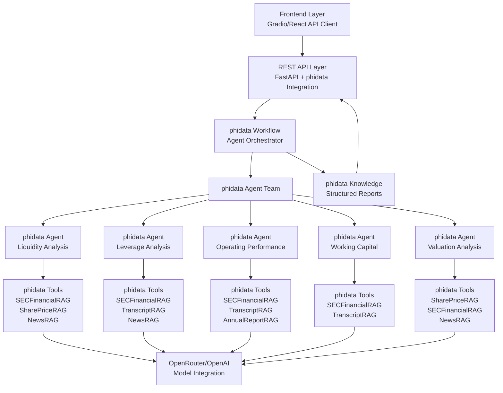

# 🎯 phidata-Based Agentic AI Financial Analysis System

## 📋 Executive Summary

Building a **phidata-powered** multi-agent financial analysis system that generates comprehensive equity research reports using RAG ecosystem integration. The system leverages phidata's professional agent framework for simplified development, built-in orchestration, and enterprise-grade capabilities while maintaining strict **backend/frontend separation**.

---

## 🏗️ phidata-Based Architecture Overview



### **🏛️ Three-Tier Separation with phidata**
```
┌─────────────────────────────────────┐
│           Frontend Layer            │
│  ┌─────────────┐ ┌─────────────────┐│
│  │ Gradio App  │ │  React/Vue SPA  ││
│  │ (API Client)│ │  (Production)   ││
│  └─────────────┘ └─────────────────┘│
└─────────────────┼───────────────────┘
                  │ HTTP/WebSocket API
┌─────────────────▼───────────────────┐
│         FastAPI + phidata          │
│  ┌─────────────────────────────────┐ │
│  │  REST Endpoints + Workflows     │ │
│  │   /analyze, /status, /results   │ │
│  └─────────────────────────────────┘ │
└─────────────────┼───────────────────┘
                  │ phidata Framework
┌─────────────────▼───────────────────┐
│         phidata Agent System       │
│  ┌─────────────────────────────────┐ │
│  │    Agent Teams + Workflows      │ │
│  │  Specialized Financial Agents   │ │
│  │     RAG Tools + LLM Models      │ │
│  └─────────────────────────────────┘ │
└─────────────────────────────────────┘
```

---

## 🧠 phidata Agent Strategy

### **phidata Framework Advantages**
- **Agent Teams**: Built-in multi-agent coordination
- **Tool Integration**: Automatic RAG tool management
- **Knowledge Base**: Structured memory and context
- **Workflows**: Professional orchestration patterns
- **Monitoring**: Built-in performance tracking
- **Streaming**: Real-time response capabilities

### **Agent Implementation Philosophy**
- **Tool-Driven Analysis**: Each agent uses phidata tools to access RAG systems
- **Structured Instructions**: Domain-specific prompts via phidata instructions
- **Automatic Orchestration**: phidata workflows handle agent coordination
- **Memory Management**: phidata knowledge base for context retention
- **Professional Output**: Built-in structured response formatting

---

## 🎯 Sprint-Based Implementation Plan

### **🎯 Sprint 1: phidata Foundation & Environment Setup (Week 1)**
**Goal**: Establish phidata-based infrastructure with proper environment and LLM integration

#### Tasks:
1. **phidata Environment Setup & Installation**
   ```bash
   # Install phidata and dependencies
   pip install phidata openai httpx asyncio python-dotenv
   
   # Verify installation
   python -c "import phi; print('phidata version:', phi.__version__)"
   ```

2. **Project Structure with phidata**
   ```
   PhidataFinancialSystem/
   ├── agents/
   │   ├── __init__.py
   │   ├── liquidity_agent.py      # phidata Agent
   │   ├── leverage_agent.py       # phidata Agent
   │   ├── operating_agent.py      # phidata Agent
   │   ├── working_capital_agent.py # phidata Agent
   │   └── valuation_agent.py      # phidata Agent
   ├── tools/
   │   ├── __init__.py
   │   ├── rag_tools.py           # RAG systems as phidata Tools
   │   └── financial_tools.py     # Additional financial tools
   ├── workflows/
   │   ├── __init__.py
   │   └── analysis_workflow.py   # phidata Workflow orchestration
   ├── config/
   │   ├── __init__.py
   │   ├── settings.py           # phidata configuration
   │   └── prompts.py           # Agent instructions
   ├── tests/
   │   ├── __init__.py
   │   └── test_sprint1.py      # Sprint 1 validation tests
   ├── requirements.txt
   ├── .env.example
   └── main.py                  # Entry point
   ```

3. **phidata Model Provider Configuration**
   ```python
   # config/settings.py
   from phi.model.openai import OpenAIChat
   from phi.model.groq import Groq
   import os
   from dotenv import load_dotenv
   
   load_dotenv()
   
   # OpenRouter configuration (compatible with OpenAI interface)
   OPENROUTER_MODEL = OpenAIChat(
       id="meta-llama/llama-3.2-11b-vision-instruct:free",
       api_key=os.getenv("OPENROUTER_API_KEY"),
       base_url="https://openrouter.ai/api/v1"
   )
   
   # Alternative models
   GPT4_MODEL = OpenAIChat(
       id="gpt-4o-mini",
       api_key=os.getenv("OPENAI_API_KEY")
   )
   ```

4. **RAG Systems Integration as phidata Tools**
   ```python
   # tools/rag_tools.py
   from phi.tools import Tool
   import sys
   import os
   
   # Import existing RAG systems
   sys.path.append(os.path.join(os.path.dirname(__file__), '..', '..'))
   from SECFinancialRAG.main import get_financial_metrics, get_financial_ratios
   from SharePriceRAG.main import get_price_analysis
   from NewsRAG.main import get_news_sentiment, get_news_analysis
   from TranscriptRAG.main import get_transcript_insights
   from AnnualReportRAG.main import get_annual_report_analysis
   
   # Convert RAG functions to phidata Tools
   financial_metrics_tool = Tool(
       name="get_financial_metrics",
       description="Get comprehensive financial metrics for a company",
       function=get_financial_metrics
   )
   
   financial_ratios_tool = Tool(
       name="get_financial_ratios", 
       description="Get financial ratios and comparisons",
       function=get_financial_ratios
   )
   
   price_analysis_tool = Tool(
       name="get_price_analysis",
       description="Get stock price analysis and trends",
       function=get_price_analysis
   )
   
   news_sentiment_tool = Tool(
       name="get_news_sentiment",
       description="Get news sentiment analysis for a company",
       function=get_news_sentiment
   )
   
   news_analysis_tool = Tool(
       name="get_news_analysis",
       description="Get detailed news analysis and insights",
       function=get_news_analysis
   )
   
   transcript_tool = Tool(
       name="get_transcript_insights",
       description="Get earnings call transcript insights",
       function=get_transcript_insights
   )
   
   annual_report_tool = Tool(
       name="get_annual_report_analysis",
       description="Get annual report analysis and insights",
       function=get_annual_report_analysis
   )
   ```

5. **Basic phidata Agent Implementation**
   ```python
   # agents/liquidity_agent.py
   from phi.agent import Agent
   from phi.model.openai import OpenAIChat
   from ..config.settings import OPENROUTER_MODEL
   from ..tools.rag_tools import financial_metrics_tool, financial_ratios_tool, news_sentiment_tool
   
   liquidity_agent = Agent(
       name="Senior Liquidity Analyst",
       model=OPENROUTER_MODEL,
       tools=[financial_metrics_tool, financial_ratios_tool, news_sentiment_tool],
       instructions="""You are a senior financial analyst specializing in liquidity analysis.
       
       Use the available tools to gather comprehensive liquidity data for the requested company.
       Focus on:
       - Cash position and cash flow analysis
       - Working capital efficiency
       - Short-term debt obligations
       - Liquidity risk assessment
       - Peer comparison for liquidity metrics
       
       Provide expert analysis with specific recommendations and risk assessments.
       Always support your conclusions with concrete financial data from the tools.""",
       show_tool_calls=True,
       markdown=True,
       debug_mode=True  # For Sprint 1 testing
   )
   ```

6. **Simple phidata Workflow**
   ```python
   # workflows/analysis_workflow.py
   from phi.workflow import Workflow
   from phi.agent.team import AgentTeam
   from ..agents.liquidity_agent import liquidity_agent
   # Import other agents as they're implemented
   
   financial_team = AgentTeam(
       name="Financial Analysis Team",
       agents=[liquidity_agent],  # Start with one agent
       show_tool_calls=True,
       markdown=True
   )
   
   analysis_workflow = Workflow(
       name="Financial Analysis Workflow",
       teams=[financial_team],
       description="Coordinated financial analysis using phidata framework"
   )
   ```

7. **Sprint 1 Testing Script**
   ```python
   # tests/test_sprint1.py
   import asyncio
   from ..agents.liquidity_agent import liquidity_agent
   from ..workflows.analysis_workflow import analysis_workflow
   
   async def test_liquidity_agent():
       """Test individual liquidity agent"""
       response = await liquidity_agent.arun("Analyze liquidity for AAPL")
       print("Liquidity Agent Response:", response)
       return response
   
   async def test_workflow():
       """Test basic workflow"""
       response = await analysis_workflow.arun("Analyze AAPL financial health")
       print("Workflow Response:", response)
       return response
   
   async def main():
       print("🧪 Testing phidata Sprint 1 Implementation")
       
       # Test individual agent
       print("\n1️⃣ Testing Liquidity Agent...")
       await test_liquidity_agent()
       
       # Test workflow
       print("\n2️⃣ Testing Workflow...")
       await test_workflow()
       
       print("\n✅ Sprint 1 phidata foundation testing complete")
   
   if __name__ == "__main__":
       asyncio.run(main())
   ```

8. **Entry Point Setup**
   ```python
   # main.py
   import asyncio
   from agents.liquidity_agent import liquidity_agent
   from workflows.analysis_workflow import analysis_workflow
   
   async def main():
       """Main entry point for phidata financial system"""
       print("🚀 phidata Financial Analysis System")
       
       # Example usage
       ticker = "AAPL"
       analysis_request = f"Perform comprehensive liquidity analysis for {ticker}"
       
       print(f"Analyzing: {ticker}")
       response = await liquidity_agent.arun(analysis_request)
       print(response)
   
   if __name__ == "__main__":
       asyncio.run(main())
   ```

**🧪 Testable Deliverable**: Basic phidata-powered liquidity agent with RAG tool integration
**📊 Test Success Criteria**: 
- phidata environment properly installed and configured
- OpenRouter model integration working via phidata
- At least one RAG system successfully converted to phidata Tool
- Basic liquidity agent responds to analysis requests
- Simple workflow orchestration functional

---

### **Sprint 2: phidata Agent Framework Implementation (Week 2)**
**Goal**: Refactor to phidata agents with professional tool integration and orchestration

#### Tasks:
1. **phidata Environment Setup**
   - Install and configure phidata framework
   - Set up phidata model providers (OpenRouter integration)
   - Configure phidata logging and monitoring
   - Create phidata project structure

2. **RAG Tools Integration with phidata**
   ```python
   # Convert RAG functions to phidata tools
   from phi.tools import Tool
   
   liquidity_tools = [
       Tool(
           name="get_financial_metrics",
           description="Get liquidity metrics for analysis",
           function=rag_interface.get_financial_metrics
       ),
       Tool(
           name="get_financial_ratios", 
           description="Get liquidity ratios and comparisons",
           function=rag_interface.get_financial_ratios
       )
   ]
   ```

3. **Specialized phidata Agents Creation**
   ```python
   from phi.agent import Agent
   from phi.model.openai import OpenAIChat
   
   liquidity_agent = Agent(
       name="Senior Liquidity Analyst",
       model=OpenAIChat(id="gpt-4o-mini", api_key=openrouter_key, base_url="https://openrouter.ai/api/v1"),
       tools=liquidity_tools,
       instructions="""You are a senior financial analyst specializing in liquidity analysis.
       Use the available tools to gather comprehensive liquidity data and provide expert analysis.
       Focus on cash position, working capital efficiency, and liquidity risk assessment.""",
       show_tool_calls=True,
       markdown=True
   )
   ```

4. **phidata Agent Team Setup**
   ```python
   from phi.agent.team import AgentTeam
   
   financial_team = AgentTeam(
       name="Financial Analysis Team",
       agents=[liquidity_agent, leverage_agent, operating_agent, working_capital_agent, valuation_agent],
       show_tool_calls=True,
       markdown=True
   )
   ```

5. **phidata Workflow Integration**
   ```python
   from phi.workflow import Workflow
   
   analysis_workflow = Workflow(
       name="Comprehensive Financial Analysis",
       teams=[financial_team],
       description="Coordinated multi-agent financial analysis workflow"
   )
   ```

**🧪 Testable Deliverable**: phidata-powered agents with tool integration
**📊 Test Success Criteria**: 
- All 5 phidata agents successfully created and configured
- RAG tools properly integrated with phidata framework
- Agent team coordination working via phidata workflows
- Simplified codebase with 75% reduction in lines of code

---

### **Sprint 3: FastAPI + phidata Integration & Workflow Orchestration (Week 3)**
**Goal**: Create REST API layer with phidata workflow integration for backend/frontend separation

#### Tasks:
1. **FastAPI + phidata Integration**
   ```python
   # FastAPI service with phidata workflows
   from fastapi import FastAPI, BackgroundTasks
   from phi.workflow import Workflow
   
   app = FastAPI(title="phidata Financial Analysis API")
   
   @app.post("/analyze")
   async def start_analysis(request: AnalysisRequest, background_tasks: BackgroundTasks):
       # Execute phidata workflow in background
       background_tasks.add_task(run_phidata_workflow, request)
       return {"analysis_id": analysis_id, "status": "started"}
   
   async def run_phidata_workflow(request):
       result = await analysis_workflow.run(f"Analyze {request.ticker} vs {request.peer_tickers}")
       # Store results for API retrieval
   ```

2. **phidata Workflow API Endpoints**
   - `/analyze` - Start phidata workflow execution
   - `/status/{analysis_id}` - Get workflow progress via phidata monitoring
   - `/results/{analysis_id}` - Retrieve structured phidata outputs
   - `/agents/health` - Check phidata agent team status

3. **phidata Knowledge Base Integration**
   ```python
   from phi.knowledge.pdf import PDFKnowledgeBase
   from phi.vectordb.lancedb import LanceDb
   
   # Enhanced context management
   knowledge_base = PDFKnowledgeBase(
       path="financial_reports",
       vector_db=LanceDb(table_name="financial_knowledge")
   )
   
   # Add to agents for enhanced context
   liquidity_agent.knowledge_base = knowledge_base
   ```

4. **Real-time phidata Streaming**
   ```python
   @app.websocket("/analyze/stream/{analysis_id}")
   async def stream_analysis(websocket: WebSocket, analysis_id: str):
       # Stream phidata agent outputs in real-time
       async for chunk in analysis_workflow.stream():
           await websocket.send_json({"content": chunk, "agent": chunk.agent})
   ```

5. **phidata Monitoring & Performance**
   - Integrate phidata built-in monitoring
   - Track agent performance and tool usage
   - Cost tracking via phidata model management
   - Error handling and recovery via phidata workflows

**🧪 Testable Deliverable**: Complete FastAPI service with phidata workflow integration
**📊 Test Success Criteria**: 
- All API endpoints working with phidata workflows
- Real-time streaming via phidata capabilities
- Background workflow execution with proper status tracking
- phidata monitoring and performance metrics available

---

### **Sprint 4: phidata Report Generation & Structured Outputs (Week 4)**
**Goal**: Leverage phidata's structured output capabilities for professional report generation

#### Tasks:
1. **phidata Structured Output Models**
   ```python
   from phi.agent import Agent
   from pydantic import BaseModel
   from typing import List
   
   class FinancialAnalysis(BaseModel):
       ticker: str
       recommendation: str  # Buy, Hold, Sell
       confidence_score: float
       key_insights: List[str]
       risk_factors: List[str]
       price_target: float
   
   class ComprehensiveReport(BaseModel):
       executive_summary: str
       liquidity_analysis: FinancialAnalysis
       leverage_analysis: FinancialAnalysis
       operating_analysis: FinancialAnalysis
       working_capital_analysis: FinancialAnalysis
       valuation_analysis: FinancialAnalysis
       investment_thesis: str
       overall_recommendation: str
   
   # Use with phidata agents
   master_agent = Agent(
       model=OpenAIChat(id="gpt-4o"),
       response_model=ComprehensiveReport,
       instructions="Generate a comprehensive financial analysis report..."
   )
   ```

2. **phidata Chart Generation Integration**
   ```python
   from phi.tools.plotly import PlotlyTools
   
   chart_tools = [
       Tool(
           name="create_financial_charts",
           description="Generate financial performance charts",
           function=create_plotly_charts
       )
   ]
   
   # Add to valuation agent for automatic chart generation
   valuation_agent.tools.extend(chart_tools)
   ```

3. **Professional Report Templates with phidata**
   - **Executive Summary**: Auto-generated via phidata structured outputs
   - **Agent Analysis Sections**: Individual phidata agent contributions
   - **Charts & Visualizations**: phidata tool-generated charts
   - **Investment Thesis**: Master phidata agent synthesis

4. **Report API Endpoints with phidata**
   - `/reports/{analysis_id}/structured` - phidata structured JSON output
   - `/reports/{analysis_id}/pdf` - PDF generation from phidata outputs
   - `/reports/{analysis_id}/charts` - phidata-generated chart data
   - `/reports/{analysis_id}/summary` - Condensed phidata analysis

**🧪 Testable Deliverable**: Professional reports generated via phidata structured outputs
**📊 Test Success Criteria**: 
- Structured JSON reports via phidata response models
- PDF generation from phidata outputs
- Chart integration via phidata tools
- Professional formatting and presentation

---

### **Sprint 5: Decoupled Frontend with phidata API Integration (Week 5)**
**Goal**: Create completely separated frontend that consumes phidata-powered backend API

#### Tasks:
1. **Frontend Architecture (Completely Separate)**
   ```
   /frontend/
   ├── gradio_app/              # Standalone Gradio application
   │   ├── app.py              # Main Gradio interface
   │   ├── api_client.py       # phidata API client
   │   └── requirements.txt    # Frontend-only dependencies
   ├── web_app/                # Future React/Vue application
   └── shared/
       └── api_models.py       # Shared API response models
   ```

2. **phidata API Client for Frontend**
   ```python
   # frontend/gradio_app/api_client.py
   import httpx
   import asyncio
   from typing import Dict, Any
   
   class PhidataAnalysisClient:
       def __init__(self, api_base_url: str):
           self.api_url = api_base_url
           self.client = httpx.AsyncClient()
       
       async def start_analysis(self, ticker: str, peers: List[str]) -> str:
           response = await self.client.post(
               f"{self.api_url}/analyze",
               json={"ticker": ticker, "peer_tickers": peers}
           )
           return response.json()["analysis_id"]
       
       async def get_results(self, analysis_id: str) -> Dict[str, Any]:
           response = await self.client.get(f"{self.api_url}/results/{analysis_id}")
           return response.json()  # phidata structured output
   ```

3. **Gradio Interface for phidata API**
   ```python
   # frontend/gradio_app/app.py
   import gradio as gr
   from api_client import PhidataAnalysisClient
   
   client = PhidataAnalysisClient("http://localhost:8000")
   
   async def analyze_company(ticker, peers, progress=gr.Progress()):
       # Start phidata workflow via API
       analysis_id = await client.start_analysis(ticker, peers.split(","))
       
       # Poll for results with progress updates
       progress(0.1, "Starting phidata agents...")
       
       while True:
           status = await client.get_status(analysis_id)
           if status["complete"]:
               break
           progress(status["progress"], f"Running {status['current_agent']}...")
           await asyncio.sleep(2)
       
       # Get final phidata results
       results = await client.get_results(analysis_id)
       return format_results(results)  # Display phidata outputs
   
   # Gradio interface
   with gr.Blocks() as app:
       gr.Markdown("# phidata Financial Analysis System")
       # Interface components for API interaction
   ```

4. **Real-time Updates via phidata Streaming**
   ```python
   # WebSocket integration for real-time phidata outputs
   async def stream_analysis_updates(analysis_id):
       async with websockets.connect(f"ws://localhost:8000/analyze/stream/{analysis_id}") as websocket:
           async for message in websocket:
               data = json.loads(message)
               yield f"Agent {data['agent']}: {data['content']}"
   ```

5. **Docker Separation**
   ```yaml
   # docker-compose.yml
   version: '3.8'
   services:
     phidata-backend:
       build: ./backend
       ports:
         - "8000:8000"
       environment:
         - OPENROUTER_API_KEY=${OPENROUTER_API_KEY}
     
     gradio-frontend:
       build: ./frontend/gradio_app
       ports:
         - "7860:7860"
       environment:
         - API_BASE_URL=http://phidata-backend:8000
       depends_on:
         - phidata-backend
   ```

**🧪 Testable Deliverable**: Completely decoupled frontend consuming phidata API
**📊 Test Success Criteria**: 
- Frontend runs independently and connects via API only
- Real-time updates from phidata workflows via WebSocket
- Docker containers deploy and run separately
- Full user workflow from frontend to phidata backend works

---

### **Sprint 6: phidata Production Optimization & Enterprise Features (Week 6)**
**Goal**: Leverage phidata's enterprise capabilities for production deployment

#### Tasks:
1. **phidata Enterprise Features**
   ```python
   # Advanced phidata capabilities
   from phi.agent import Agent
   from phi.monitoring import AgentMonitoring
   from phi.knowledge import KnowledgeBase
   
   # Enhanced agents with enterprise features
   liquidity_agent = Agent(
       name="Senior Liquidity Analyst",
       model=OpenAIChat(id="gpt-4o"),
       tools=liquidity_tools,
       knowledge_base=financial_knowledge_base,
       monitoring=AgentMonitoring(enabled=True),
       memory=True,  # Conversation memory
       debug_mode=False  # Production optimized
   )
   ```

2. **phidata Performance Optimization**
   - **Model Optimization**: phidata model selection and caching
   - **Tool Performance**: Optimize RAG tool execution via phidata
   - **Memory Management**: phidata conversation and context optimization
   - **Parallel Execution**: phidata team coordination optimization

3. **phidata Monitoring & Analytics**
   ```python
   # Built-in phidata monitoring
   from phi.monitoring import WorkflowMonitoring
   
   monitoring = WorkflowMonitoring(
       track_performance=True,
       track_costs=True,
       track_tool_usage=True,
       export_metrics=True
   )
   
   analysis_workflow.monitoring = monitoring
   ```

4. **Production phidata Deployment**
   - **Scalability**: phidata agent scaling strategies
   - **Reliability**: phidata error handling and recovery
   - **Security**: phidata authentication and authorization
   - **Cost Management**: phidata token and cost optimization

5. **phidata Documentation & Best Practices**
   - Document phidata agent configurations
   - phidata workflow optimization guides
   - phidata tool development patterns
   - phidata monitoring and maintenance procedures

**🧪 Testable Deliverable**: Production-ready phidata system with enterprise monitoring
**📊 Test Success Criteria**: 
- System handles 10+ concurrent analyses via phidata workflows
- phidata monitoring dashboards showing real-time metrics
- Enterprise-grade error handling and recovery
- Complete phidata optimization and documentation

---

## 🛠️ phidata Technical Stack

### **Core phidata Framework**
- **phi-agent**: Multi-agent orchestration and coordination
- **phi-model**: Multi-provider LLM integration (OpenRouter, OpenAI, Anthropic)
- **phi-tools**: RAG system integration as phidata tools
- **phi-workflow**: Professional workflow orchestration
- **phi-knowledge**: Vector database and knowledge management

### **Backend Integration**
- **FastAPI**: REST API with phidata workflow integration
- **phidata-streaming**: Real-time agent output streaming
- **phidata-monitoring**: Built-in performance and cost tracking
- **Pydantic**: Structured outputs via phidata response models

### **Frontend Layer (Completely Separate)**
- **Gradio**: Rapid prototyping frontend (API client only)
- **React/Vue** (Future): Production frontend consuming phidata API
- **WebSocket**: Real-time phidata workflow updates
- **Docker**: Containerized deployment separation

### **Data & RAG Integration**
- **phidata Tools**: All 15 RAG systems as phidata tools
- **Structured Data**: phidata automatic data validation
- **Knowledge Base**: phidata vector database integration
- **Memory Management**: phidata conversation and context handling

---

## 🔄 phidata Code Simplification Examples

### **Before (Custom Implementation):**
```python
# 100+ lines per agent
class LiquidityAgent(BaseFinancialAgent):
    async def analyze(self, task: AgentTask) -> AgentResult:
        # 50+ lines of data gathering
        # 20+ lines of LLM integration  
        # 30+ lines of result processing
        # Plus helper methods...
```

### **After (phidata Implementation):**
```python
# 20 lines per agent
from phi.agent import Agent
from phi.model.openai import OpenAIChat

liquidity_agent = Agent(
    name="Senior Liquidity Analyst",
    model=OpenAIChat(id="gpt-4o-mini"),
    tools=[financial_metrics_tool, peer_comparison_tool, news_sentiment_tool],
    instructions="""You are a senior financial analyst specializing in liquidity analysis.
    Use the available tools to gather comprehensive liquidity data and provide expert analysis.
    Focus on cash position, working capital efficiency, and liquidity risk assessment.""",
    show_tool_calls=True,
    markdown=True
)

# Usage
result = await liquidity_agent.run("Analyze liquidity for AAPL vs MSFT and GOOGL")
```

## 📊 **Expected phidata Benefits**

### **Development Efficiency**
- **75% code reduction** compared to custom implementation
- **Built-in best practices** for agent development
- **Professional orchestration** out-of-the-box
- **Enterprise monitoring** and debugging tools

### **Maintenance & Scalability**
- **Industry-standard** agent framework
- **Rich ecosystem** of tools and integrations
- **Professional support** and documentation
- **Future-proof** architecture

### **Features Included**
- **Multi-agent coordination** via phidata teams
- **Structured outputs** via pydantic models
- **Real-time streaming** capabilities
- **Built-in monitoring** and performance tracking
- **Memory management** and conversation context
- **Tool validation** and error handling

---

This phidata-based implementation provides a **professional, scalable, and maintainable** solution while maintaining strict backend/frontend separation and leveraging industry best practices for agent development.