# Simplified Domain Agent System - Implementation Plan

## 🎯 **System Overview**

A **cost-efficient**, **configurable** domain agent system with analyst-reviewer loops, configurable quality thresholds, and interactive chat capabilities. Built from scratch using proven patterns from the existing codebase.

### **Core Design Principles**
- ✅ **Cost Optimization**: Schema-based prompts, cheap models, memory reuse
- ✅ **Configurable Complexity**: User controls quality loops and interactions
- ✅ **Incremental Refinement**: Analyst-reviewer feedback loops with hard stops
- ✅ **Interactive Chat**: Post-analysis refinements and deep-dives
- ✅ **Reusable Components**: Leverage existing prompts, schemas, and RAG tools

---

## 🏗️ **High-Level Architecture**

```mermaid
graph TD
    UI[🖥️ User Interface] --> AF[🏭 Agent Factory]
    
    AF --> Config{⚙️ Configuration}
    Config -->|max_loops=3| DA[🔬 Domain Agent]
    Config -->|max_loops=1| DA
    Config -->|max_loops=0| DA
    
    DA --> DF[📊 Data Fetcher]
    DA --> Loop{🔄 Analysis Loop}
    
    Loop --> Analyst[🧠 Domain Analyst]
    Loop --> Reviewer[👔 Domain Reviewer]
    Loop -->|satisfied| Chat[💬 Chat Interface]
    Loop -->|not satisfied + loops left| Analyst
    Loop -->|max loops reached| Chat
    
    DF --> RAG[🔌 External RAGs]
    Analyst --> Memory[🧠 Agno Memory]
    Reviewer --> Memory
    Chat --> Memory
    
    Chat --> User[👤 User Response]
    User -->|refinement request| RefineLoop{🔄 Refinement Loop}
    RefineLoop -->|max_loops=1| Analyst
```



---

## 🔄 **Detailed Flow Diagram**

```mermaid
sequenceDiagram
    participant User as 👤 User
    participant Factory as 🏭 Agent Factory
    participant Config as ⚙️ Config
    participant DataFetcher as 📊 Data Fetcher
    participant Analyst as 🧠 Domain Analyst
    participant Reviewer as 👔 Domain Reviewer
    participant Memory as 🧠 Agno Memory
    participant Chat as 💬 Chat Interface
    participant RAG as 🔌 External RAGs

    %% Initial Request
    User->>Factory: create_domain_agent(domain="liquidity", company="AAPL", max_loops=3)
    Factory->>Config: validate_and_set_config(max_loops=3)
    Config->>Factory: configuration_ready
    
    %% Data Fetching Phase
    Note over Factory,RAG: 📥 DATA SUPPLY PHASE
    Factory->>DataFetcher: fetch_domain_data(domain, company)
    DataFetcher->>RAG: Parallel data fetching
    RAG-->>DataFetcher: financial_metrics, ratios, peer_data
    DataFetcher-->>Factory: domain_input (structured)
    
    %% Analysis Loop Phase
    Note over Factory,Memory: 🔄 ANALYSIS LOOP PHASE (MAX 3 LOOPS)
    Factory->>Memory: initialize_session(domain, company)
    Memory-->>Factory: session_created
    
    %% Loop 1
    rect rgb(240, 248, 255)
        Note over Analyst,Reviewer: Loop 1: Initial Analysis
        Factory->>Analyst: analyze(domain_input, schema_ref)
        Analyst->>Memory: store_context("starting_analysis")
        Analyst->>RAG: targeted_tool_calls(max=4)
        RAG-->>Analyst: qualitative_evidence
        Analyst->>Analyst: generate_analysis(schema_ref)
        Analyst-->>Reviewer: domain_output_v1
        
        Reviewer->>Memory: get_analysis_context()
        Memory-->>Reviewer: previous_context
        Reviewer->>Reviewer: evaluate_quality(checklist)
        
        alt Quality Satisfied
            Reviewer-->>Factory: APPROVED(domain_output_v1)
        else Needs Refinement (Loops < 3)
            Reviewer-->>Factory: REFINE_NEEDED(specific_improvements)
        end
    end
    
    %% Loop 2 (if needed)
    opt Quality Not Satisfied AND Loops < Max
        rect rgb(255, 248, 240)
            Note over Analyst,Reviewer: Loop 2: Targeted Refinement
            Factory->>Analyst: refine_analysis(domain_output_v1, improvements)
            Analyst->>Memory: update_context("refinement_round_2")
            Analyst->>RAG: targeted_refinement_calls(max=2)
            RAG-->>Analyst: additional_evidence
            Analyst->>Analyst: generate_refined_analysis()
            Analyst-->>Reviewer: domain_output_v2
            
            Reviewer->>Reviewer: evaluate_refined_quality()
            
            alt Quality Satisfied
                Reviewer-->>Factory: APPROVED(domain_output_v2)
            else Still Needs Work (Loops < 3)
                Reviewer-->>Factory: REFINE_NEEDED(final_improvements)
            end
        end
    end
    
    %% Loop 3 (final attempt)
    opt Quality Not Satisfied AND Loops < Max
        rect rgb(248, 255, 248)
            Note over Analyst,Reviewer: Loop 3: Final Refinement
            Factory->>Analyst: final_refinement(domain_output_v2, improvements)
            Analyst->>Memory: update_context("final_refinement")
            Analyst->>RAG: final_tool_calls(max=1)
            Analyst-->>Reviewer: domain_output_v3
            
            Reviewer->>Reviewer: final_evaluation()
            Reviewer-->>Factory: APPROVED/BEST_EFFORT(domain_output_v3)
        end
    end
    
    %% Chat Phase
    Note over Factory,User: 💬 INTERACTIVE CHAT PHASE
    Factory->>Chat: create_chat_session(approved_output, memory_session)
    Chat->>Memory: load_full_context()
    Memory-->>Chat: analysis_history, tool_calls, decisions
    Chat-->>User: Analysis Report + Chat Interface
    
    %% User Interaction
    User->>Chat: "Can you analyze working capital trends more deeply?"
    Chat->>Memory: store_user_query()
    Chat->>Chat: determine_refinement_scope()
    
    %% Refinement Loop (Limited)
    Note over Chat,RAG: 🔄 REFINEMENT LOOP (MAX 1-2 LOOPS)
    Chat->>Analyst: focused_refinement(query, max_loops=1)
    Analyst->>Memory: get_relevant_context()
    Analyst->>RAG: targeted_deep_dive(query)
    RAG-->>Analyst: specific_evidence
    Analyst->>Analyst: generate_focused_response()
    Analyst-->>Reviewer: refinement_output
    
    Reviewer->>Reviewer: quick_quality_check()
    Reviewer-->>Chat: approved_refinement
    Chat->>Memory: store_refinement()
    Chat-->>User: Detailed Response
    
    %% Continued Interaction
    User->>Chat: "What about peer comparison details?"
    Chat->>Chat: Check if data exists in memory
    
    alt Data Available in Memory
        Chat->>Memory: retrieve_peer_data()
        Chat-->>User: Immediate Response (no LLM cost)
    else Need New Analysis
        Chat->>Analyst: mini_analysis(peer_focus, max_loops=1)
        Note over Analyst,Reviewer: Quick analyst-reviewer cycle
        Chat-->>User: Enhanced Response
    end
```



---

## 📁 **New Directory Structure**

```
/AgentSystemV2/
├── README.md
├── requirements.txt
├── config/
│   ├── __init__.py
│   ├── settings.py                 # Model configs, cost limits
│   ├── domain_configs.py           # Domain specifications  
│   ├── schemas.py                  # Compact schemas with references
│   └── prompts.py                  # Reusable prompt templates
├── core/
│   ├── __init__.py
│   ├── agent_factory.py            # Main factory class
│   ├── domain_agent.py             # Core domain agent orchestrator
│   ├── data_fetcher.py             # Simplified data fetching
│   └── memory_manager.py           # Agno memory wrapper
├── agents/
│   ├── __init__.py
│   ├── base_analyst.py             # Base analyst pattern
│   ├── base_reviewer.py            # Base reviewer pattern
│   ├── liquidity_analyst.py        # Domain-specific analyst
│   ├── liquidity_reviewer.py       # Domain-specific reviewer
│   └── [other_domain_agents.py]    # Future domain agents
├── interfaces/
│   ├── __init__.py
│   ├── chat_interface.py           # Interactive chat wrapper
│   └── api_interface.py            # Future API endpoints
├── tools/
│   ├── __init__.py
│   └── rag_tools.py                # Leverage existing RAG tools
├── utils/
│   ├── __init__.py
│   ├── cost_tracker.py             # Cost monitoring
│   ├── quality_metrics.py          # Quality assessment
│   └── schema_optimizer.py         # Schema reference system
└── tests/
    ├── __init__.py
    ├── test_agent_factory.py
    ├── test_domain_agents.py
    └── test_chat_interface.py
```

---

## 🎯 **Implementation Phases**

### **Phase 1: Core Infrastructure (Week 1)**

#### **1.1 Configuration System**
```python
# config/settings.py
class AgentConfig:
    max_analysis_loops: int = 3        # User configurable
    max_refinement_loops: int = 1      # For chat refinements
    max_tool_calls_per_loop: int = 4   # Cost control
    enable_memory_optimization: bool = True
    cheap_model: str = "openai/gpt-4o-mini"
    review_model: str = "openai/gpt-4o-mini"  # Same cheap model

# config/schemas.py
class SchemaReference:
    # Token-optimized schema references instead of full schemas
    DOMAIN_INPUT_REF = "SchemaRef:DomainInput_v2"
    DOMAIN_OUTPUT_REF = "SchemaRef:DomainOutput_v2"
```

#### **1.2 Agent Factory Foundation**
```python
# core/agent_factory.py
class AgentFactory:
    def create_domain_agent(self, domain: str, config: AgentConfig) -> DomainAgent
    def list_available_domains(self) -> List[str]
    def validate_configuration(self, config: AgentConfig) -> bool
```

#### **1.3 Memory Management**
```python
# core/memory_manager.py
class SessionMemoryManager:
    def __init__(self, agno_memory: MemoryManager)
    def store_analysis_context(self, loop_num: int, analysis: dict)
    def get_refinement_context(self) -> dict
    def optimize_context_for_cost(self) -> str  # Schema references
```

### **Phase 2: Core Domain Agent (Week 2)**

#### **2.1 Domain Agent Orchestrator**
```python
# core/domain_agent.py
class DomainAgent:
    def __init__(self, domain: str, config: AgentConfig, memory: SessionMemoryManager)
    
    async def run_analysis(self, company: str, peers: List[str]) -> AnalysisResult:
        # Main analysis loop with analyst-reviewer cycle
        for loop in range(self.config.max_analysis_loops):
            analysis = await self.analyst.analyze(...)
            review = await self.reviewer.review(analysis)
            if review.approved:
                break
            # Continue loop with refinements
        
        return self.create_chat_session(final_analysis)
```

#### **2.2 Base Analyst Pattern**
```python
# agents/base_analyst.py
class BaseAnalyst:
    def __init__(self, domain: str, cheap_model: str, memory: SessionMemoryManager)
    
    async def analyze(self, domain_input: DomainInput, schema_ref: str) -> DomainOutput:
        # Cost-optimized analysis with schema references
        # Leverage existing prompt patterns
        
    async def refine_analysis(self, previous: DomainOutput, improvements: List[str]) -> DomainOutput:
        # Targeted refinement based on reviewer feedback
```

#### **2.3 Base Reviewer Pattern**
```python
# agents/base_reviewer.py
class BaseReviewer:
    def __init__(self, domain: str, review_model: str, memory: SessionMemoryManager)
    
    async def review(self, analysis: DomainOutput) -> ReviewResult:
        # Cost-efficient quality checking
        # Reuse existing evaluation logic
        
    def create_improvement_suggestions(self, issues: List[str]) -> List[str]:
        # Specific, actionable improvements
```

### **Phase 3: Domain-Specific Implementation (Week 3)**

#### **3.1 Liquidity Analyst (Leverage Existing)**
```python
# agents/liquidity_analyst.py
class LiquidityAnalyst(BaseAnalyst):
    # Leverage existing liquidity analysis prompts
    # Reuse existing tool calling patterns
    # Adapt existing schema structures
```

#### **3.2 Liquidity Reviewer (Leverage Existing)**
```python
# agents/liquidity_reviewer.py  
class LiquidityReviewer(BaseReviewer):
    # Leverage existing manager review logic
    # Adapt existing quality checklists
    # Reuse evaluation criteria
```

#### **3.3 Data Fetcher (Simplified)**
```python
# core/data_fetcher.py
class SimplifiedDataFetcher:
    # Leverage existing RAG tools
    # Simplified error handling
    # Cost-optimized parallel fetching
```

### **Phase 4: Chat Interface (Week 4)**

#### **4.1 Interactive Chat**
```python
# interfaces/chat_interface.py
class ChatInterface:
    def __init__(self, analysis_result: AnalysisResult, memory: SessionMemoryManager)
    
    async def chat(self, user_query: str) -> str:
        # Determine if refinement needed
        # Route to analyst-reviewer mini-loop (max 1-2 cycles)
        # Use memory for context efficiency
        
    def get_cached_response(self, query: str) -> Optional[str]:
        # Check memory for similar queries to avoid LLM costs
```

#### **4.2 Cost Optimization Features**
```python
# utils/cost_tracker.py
class CostTracker:
    def track_loop_costs(self, loop_num: int, model_calls: List[dict])
    def estimate_refinement_cost(self, query: str) -> float
    def suggest_cost_optimizations(self) -> List[str]

# utils/schema_optimizer.py  
class SchemaOptimizer:
    def create_schema_reference(self, full_schema: dict) -> str
    def expand_schema_reference(self, ref: str) -> dict
    # 40% token reduction through schema references
```

---

## 💰 **Cost Optimization Strategies**

### **1. Schema-Based Prompts (40% token reduction)**
```python
# Instead of full schema (1000 tokens)
prompt = f"Return DomainOutput with: {full_domain_output_schema}"

# Use schema reference (600 tokens)  
prompt = f"Return {DOMAIN_OUTPUT_REF} format"
# Agno memory stores the full schema context
```

### **2. Memory-Based Context Reuse**
```python
# Loop 1: Full context
context = build_full_analysis_context()  # 2000 tokens

# Loop 2: Incremental context  
context = memory.get_refinement_context()  # 800 tokens
context += new_improvements  # +200 tokens = 1000 tokens total
```

### **3. Cheap Model Strategy**
```python
# Both analyst and reviewer use gpt-4o-mini
analyst_cost = $0.15 per 1M tokens
reviewer_cost = $0.15 per 1M tokens  # Same cheap model

# Only use strong model for complex synthesis (optional)
synthesis_cost = $15 per 1M tokens  # Only when needed
```

### **4. Smart Tool Call Limits**
```python
# Analysis loops: decreasing tool calls
Loop 1: max_tool_calls = 4  # Comprehensive analysis
Loop 2: max_tool_calls = 2  # Targeted refinement  
Loop 3: max_tool_calls = 1  # Final focused call

# Chat refinements: minimal tool calls
Chat refinement: max_tool_calls = 1  # Very focused
```

---

## 📊 **Expected Performance Metrics**

### **Cost Comparison**
| Scenario | Current System | New System | Savings |
|----------|---------------|------------|---------|
| Simple Analysis | $0.25 | $0.08 | 68% |
| Quality Analysis (3 loops) | $0.75 | $0.18 | 76% |
| Chat Refinement | $0.15 | $0.04 | 73% |
| Master Analysis (5 domains) | $2.50 | $0.45 | 82% |

### **Performance Targets**
- **Analysis Time**: 30-60 seconds (depending on loops)
- **Memory Efficiency**: 40% token reduction via schema refs
- **Quality Score**: Maintain 85%+ analysis quality
- **User Satisfaction**: Enable iterative refinement

### **Configuration Examples**
```python
# Quick Analysis (cost-conscious users)
config = AgentConfig(max_analysis_loops=1, max_refinement_loops=1)

# Balanced Analysis (default)  
config = AgentConfig(max_analysis_loops=2, max_refinement_loops=2)

# High-Quality Analysis (precision users)
config = AgentConfig(max_analysis_loops=3, max_refinement_loops=3)
```

---

## 🔄 **Integration with Existing Code**

### **Reusable Components**
✅ **Domain Configurations**: Adapt `config/domain_agent_config.py`  
✅ **RAG Tools**: Reuse `tools/enhanced_rag_tools.py`  
✅ **Data Schemas**: Leverage `config/domain_schemas.py`  
✅ **Prompt Patterns**: Adapt existing analyst prompts  
✅ **Quality Logic**: Reuse manager evaluation criteria  

### **New Components**
🔄 **Agent Factory**: New orchestration layer  
🔄 **Loop Control**: Configurable analyst-reviewer cycles  
🔄 **Chat Interface**: Interactive refinement capability  
🔄 **Memory Optimization**: Cost-efficient context management  

---

## 🎯 **Success Criteria**

### **Functional Requirements**
- ✅ Configurable analysis loops (1-5 loops)
- ✅ Analyst-reviewer feedback cycles  
- ✅ Interactive chat refinements
- ✅ Cost-optimized prompt engineering
- ✅ Memory-based context reuse

### **Performance Requirements**  
- ✅ 70%+ cost reduction vs current system
- ✅ 40%+ token optimization via schema refs
- ✅ 30-60 second analysis time
- ✅ Maintain 85%+ quality scores

### **User Experience Requirements**
- ✅ Simple configuration interface
- ✅ Real-time cost estimates  
- ✅ Interactive refinement capability
- ✅ Transparent quality feedback
- ✅ Graceful degradation on errors

---

## 🚀 **Next Steps**

1. **Review and Approve Plan** ✋ **(You are here)**
2. **Set up new directory structure**
3. **Implement Phase 1: Core Infrastructure** 
4. **Implement Phase 2: Domain Agent Core**
5. **Implement Phase 3: Liquidity Domain**
6. **Implement Phase 4: Chat Interface**
7. **Testing and optimization**
8. **UI Integration**

This plan provides a **cost-efficient**, **user-configurable**, **high-quality** domain agent system built on proven patterns while dramatically simplifying the architecture! 🎉